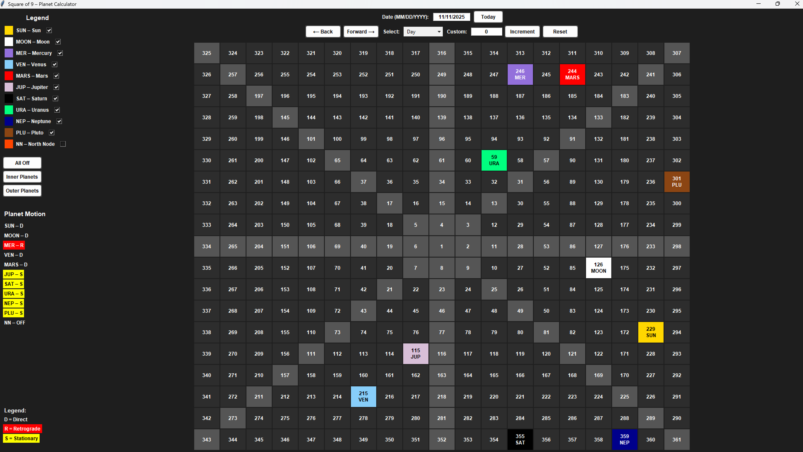

# Square of 9 – Planetary Tracker

This project is a Python desktop application that tracks the movement of the planets as they travel through the zodiac using the classical Square of 9 method. It’s designed to help visualize planetary cycles, alignments, and degrees in motion over time.

---

## Overview

The program builds a spiral Square of 9 grid and maps planetary positions onto it based on their zodiacal degrees. It reads ephemeris data, displays each planet’s position, and shows whether it’s moving direct, retrograde, or stationary. You can move forward or backward in time by days, weeks, months, or years.

It’s built with **Python** and uses **Tkinter** for the interface. The layout includes checkboxes to toggle planets on or off, buttons for inner and outer planet groups, and motion indicators for each body.

---

## Features

- Tracks all major planets plus the Moon and North Node  
- Step through time by day, week, month, or year  
- Displays retrograde, direct, and stationary motion  
- Toggle planets individually or by group  
- Dark-themed interface  
- Reads planetary data from CSV ephemeris files  
- Runs from 1900 to 2034  

---

## 🖼️ Screenshot

